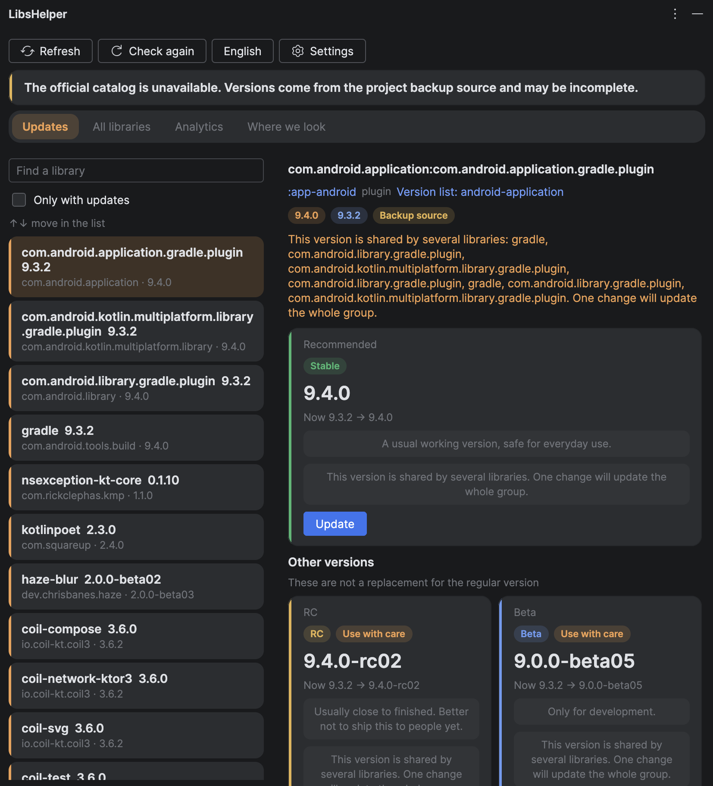
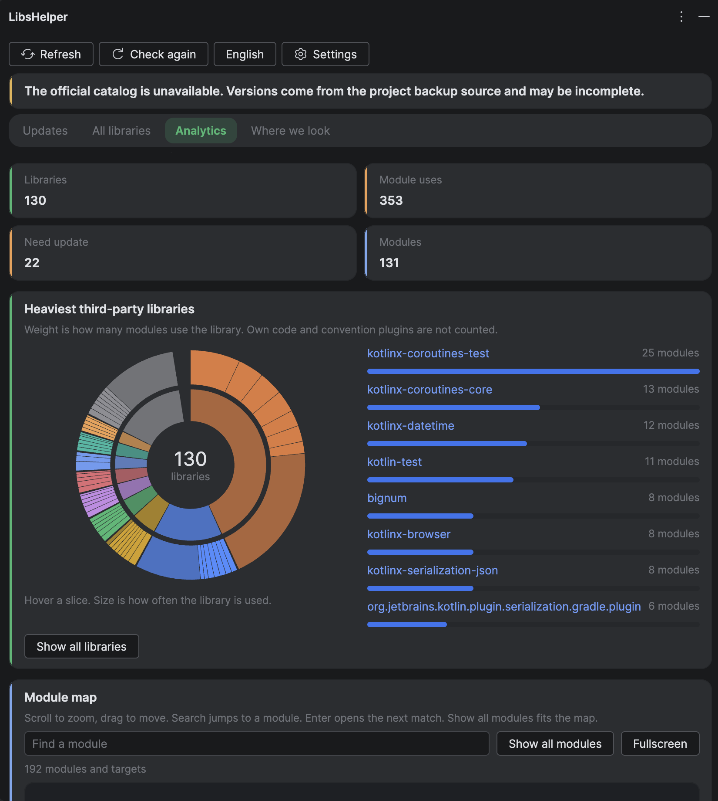
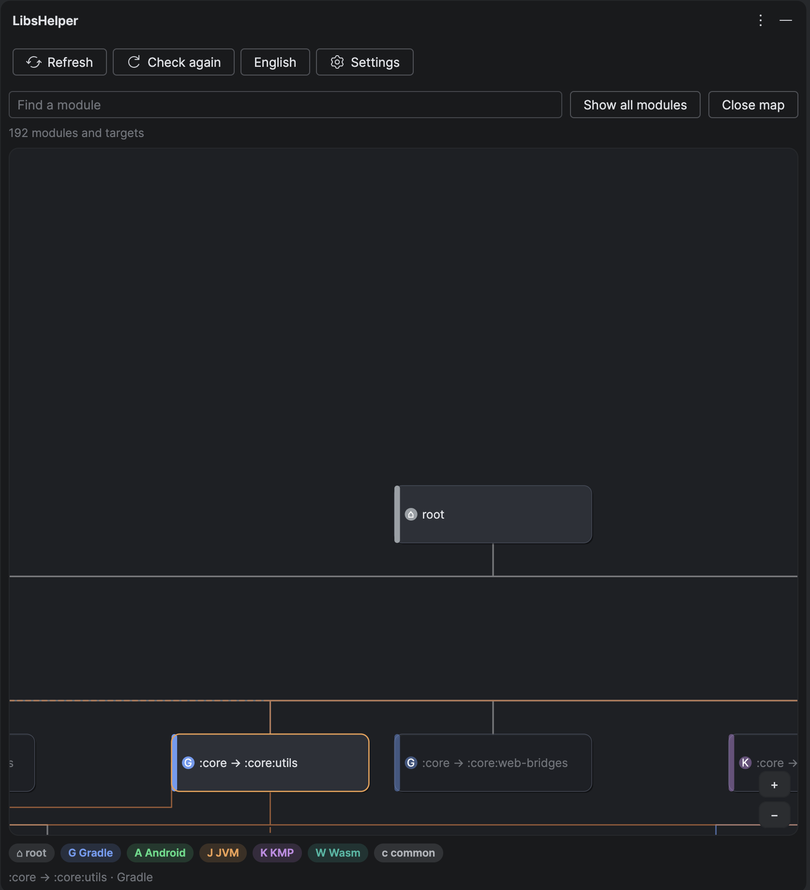
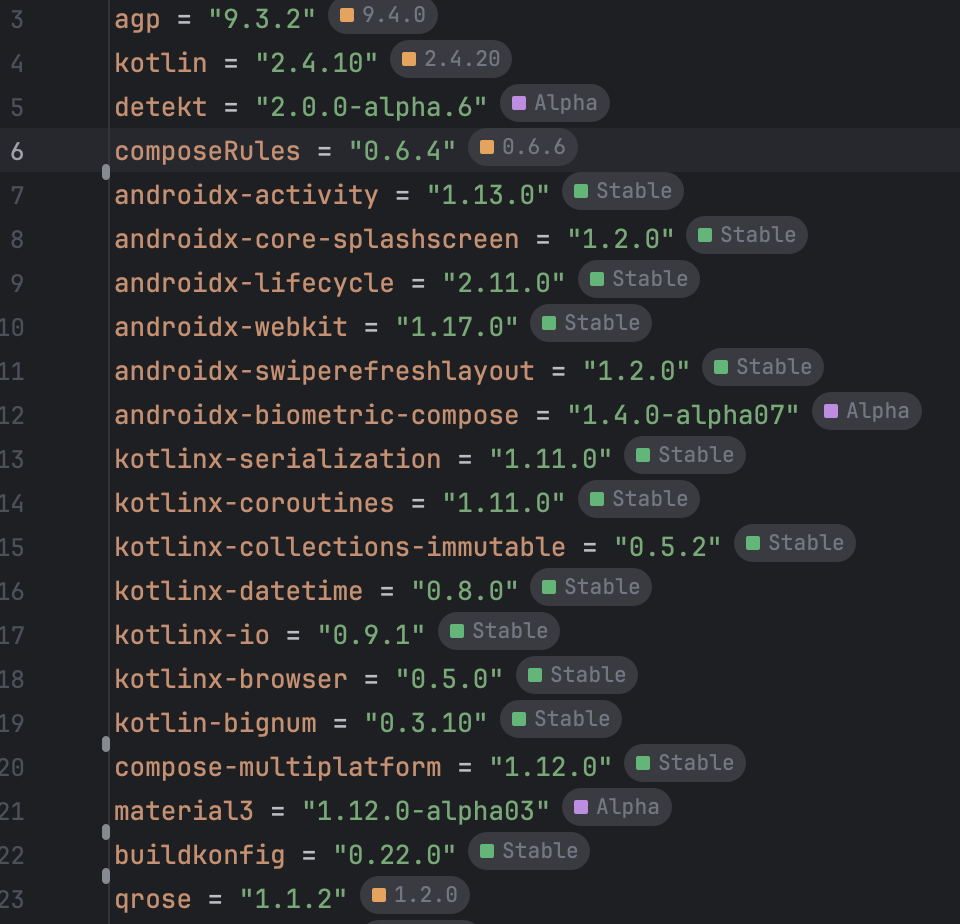

# LibsHelper

Android Studio / IntelliJ plugin for Gradle projects. It reads declared libraries, recommends a **stable** update, and shows RC / Beta / Alpha separately. English and Russian UI.

[English](#english) · [Русский](#русский)

<p align="center">
  
</p>
<p align="center"><sub>Updates — recommended stable version, group warning, RC / Beta nearby</sub></p>

<p align="center">
  
  &nbsp;
  
</p>
<p align="center">
  
</p>

---

## English

LibsHelper opens as a tool window on the right. It collects dependencies from `gradle/libs.versions.toml` and `build.gradle(.kts)`, then asks **Maven Central**, **Google Maven**, and the **Gradle Plugin Portal**. A project backup catalog is used only if the official one does not answer.

### Features

- **Updates** — search, “only with updates”, recommended **Stable** with an **Update** button. RC / Beta / Alpha / Snapshot are listed separately and are not treated as a replacement for the regular version.
- **All libraries** — full inventory, including libraries that are already current.
- **Analytics** — counts (libraries, module uses, outdated, modules), a sunburst of the heaviest third-party libraries, and a **module map** (Gradle / Android / JVM / KMP / Wasm / common). Scroll to zoom, drag to pan, search jumps to a module.
- **Where we look** — official catalogs vs project backup / private sources; sign-in when a catalog asks for it.
- **Inlay hints** in `libs.versions.toml` and build files: the next stable version next to the declaration (click opens LibsHelper).
- **Shared versions** — if several libraries share one catalog version, one change updates the whole group.
- **Private catalogs** — login, token, or custom header; secrets stay in the IDE Password Safe.
- Language switch (EN / RU) without restarting the IDE.

### How to use

1. Open an Android or Gradle project.
2. Open **LibsHelper** in the right tool window (or **Tools → Refresh libraries**).
3. On **Updates**, pick a library. Read the Stable card, then **Update** to write the version into the catalog or build file.
4. **Check again** ignores the cache and queries catalogs from scratch.
5. **Settings → Tools → LibsHelper** — language and credentials for private Maven hosts.

Editor: right-click a library declaration → **Open in LibsHelper**.

### Run and install

**Requirements:** JDK 21, IntelliJ Platform 252+ (target: Android Studio Quail 4 / 2026.1.4). Use the Gradle Wrapper from this repo.

Run in a sandbox IDE (plugin already installed):

```bash
./gradlew runIde
```

Build a ZIP and install from disk:

```bash
./gradlew :core:test
./gradlew test
./gradlew buildPlugin
```

ZIP: `build/distributions/LibsHelperPlugin-1.0.0.zip`  
**Settings → Plugins → Install Plugin from Disk…**

### Limits

- Private catalogs without sign-in are marked as “sign-in needed”.
- A recommendation is not a green build: major bumps, BOMs, and mixed library families still need a check.

---

## Русский

Плагин для Android Studio / IntelliJ. Читает библиотеки Gradle-проекта и подсказывает **обычную рабочую (Stable)** версию. Почти готовые, тестовые и черновые версии показывает отдельно. Интерфейс на русском и английском.

### Возможности

- **Обновления** — поиск, фильтр «только с обновлениями», карточка **Stable** и кнопка **Обновить**. RC / Beta / Alpha / Snapshot — отдельно, это не замена рабочей версии.
- **Все библиотеки** — полный список, включая уже актуальные.
- **Аналитика** — счётчики (библиотеки, подключения, что обновить, модули), диаграмма самых «тяжёлых» сторонних библиотек и **карта модулей** (Gradle / Android / JVM / KMP / Wasm / common). Колёсико — масштаб, перетаскивание — движение, поиск прыгает к модулю.
- **Откуда берём версии** — официальные каталоги и запасной / закрытый источник проекта; вход, если каталог просит.
- **Подсказки в редакторе** в `libs.versions.toml` и файлах сборки: рядом с версией — рекомендуемое обновление (клик открывает LibsHelper).
- **Общие версии** — если одну версию делят несколько библиотек, одно изменение затронет всю группу.
- **Закрытые каталоги** — логин, токен или свой заголовок; пароли хранятся в IDE, не в проекте.
- Смена языка без перезапуска IDE.

### Как пользоваться

1. Откройте Android или Gradle проект.
2. Откройте окно **LibsHelper** справа (или **Tools → Обновить список библиотек**).
3. На вкладке **Обновления** выберите библиотеку. Прочитайте карточку Stable и нажмите **Обновить** — версия запишется в каталог или файл сборки.
4. **Проверить заново** не берёт кэш и спрашивает каталоги с нуля.
5. **Settings → Tools → LibsHelper** — язык и вход в закрытые Maven-каталоги.

В редакторе: правый клик по объявлению библиотеки → **Открыть в LibsHelper**.

### Запуск и установка

**Нужно:** JDK 21, IntelliJ Platform 252+ (целевая студия: Android Studio Quail 4 / 2026.1.4). Сборка — Gradle Wrapper из репозитория.

Песочница IDE с уже установленным плагином:

```bash
./gradlew runIde
```

Собрать ZIP и поставить с диска:

```bash
./gradlew :core:test
./gradlew test
./gradlew buildPlugin
```

ZIP: `build/distributions/LibsHelperPlugin-1.0.0.zip`  
**Settings → Plugins → Install Plugin from Disk…**

### Ограничения

- Закрытые каталоги без входа помечаются как «нужен вход».
- Рекомендация не гарантирует зелёную сборку: большой скачок версии, BOM и несовместимые семейства всё равно стоит проверить.

---

## License

[MIT](LICENSE)
